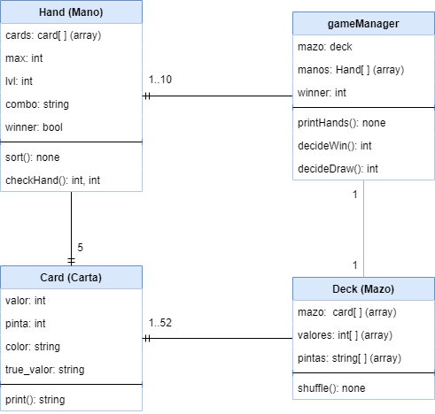

# Flex-poker
Implementación rápida para una instanciación de un juego de Póker. Creada sólamente usando HTML, Javascript y CSS.

## Modelo utilizado
Las clases utilizadas se ven en el siguiente diagrama:

